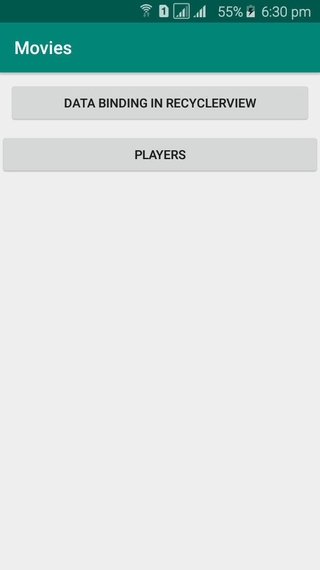
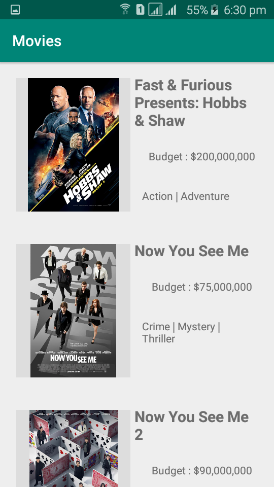
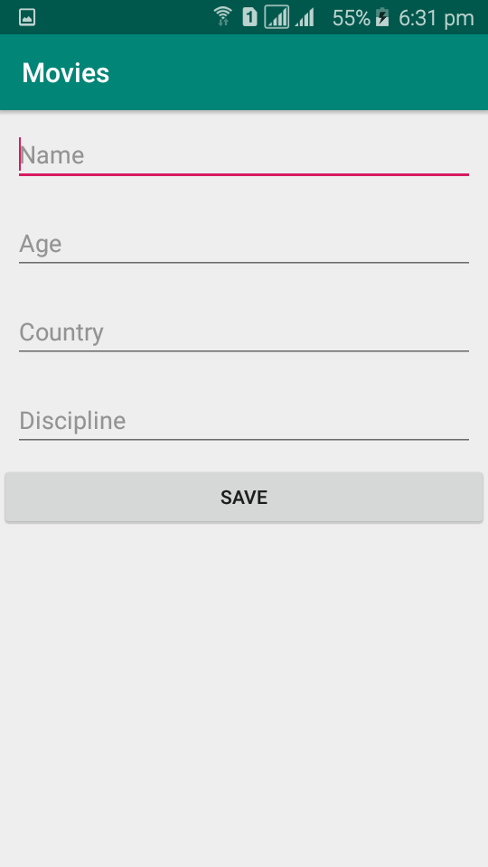

# Android-Architecture-Components
  

## Features
So far, following components are added :

- Data Binding (JSON Parsing in a recyclerview)
- ROOM Database

### To Do
- Internet Connection check in recyclerview
- Click Event in Reyclerview
- Delete & Update operation in Room Database
